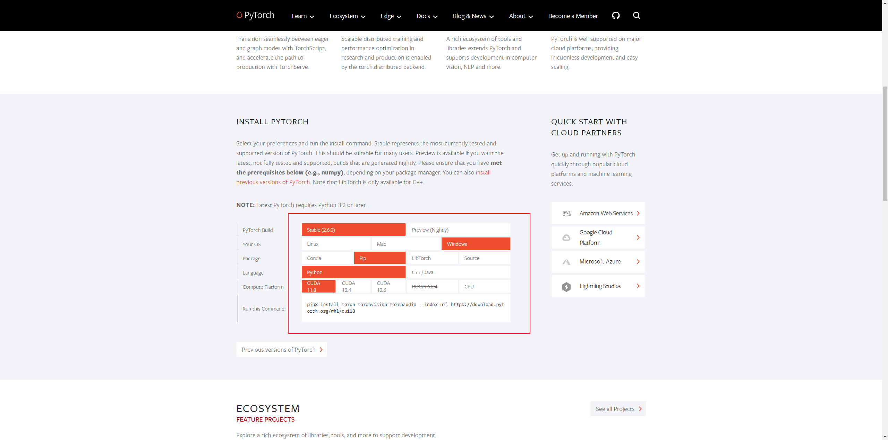
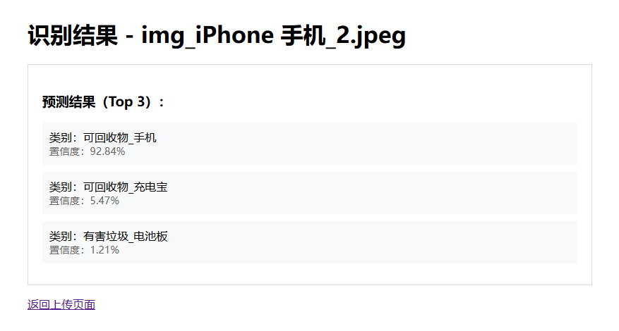

# 垃圾分类模型

## 介绍

1. 使用python+pytorch+efficientnet_b3实现
2. web服务使用flask

## build

1. 使用最新的cuda12.6
    ```bash
    # 手动执行
    python -m venv venv
    
    venv\Scripts\activate
    
    python.exe -m pip install --upgrade pip
     
    pip install torch torchvision torchaudio --index-url https://download.pytorch.org/whl/cu126  ## 替换适合自己的版本
    ```
   windows
    ```bash
    pip install -r win-requirements.txt
    ```
    unix
    ```bash
    pip install -r unix-requirements.txt
    ```
2. 其余版本: 进入 [Pytorch官网](https://pytorch.org/) 后查看
    
    
    > ps: 官网提供命令为 `pip3` , 换成 `pip`


## 训练模型
1. 准备垃圾图片库
    > ps: 垃圾图片目录结构为: 
    >
    >  - 垃圾图片库(位于项目根目录)
    >    - 分类文件名(例如: 危害垃圾_电池)
    >      - img_0.png/jpg/jpeg

2. 清空 `class_images.json` (该文件内容为获取 垃圾如片库 内的全部子文件夹名称为训练的分类标签)

3. 执行 `python train.py`即可进行训练, 训练结束会生成名为 `garbage_classifier_bast.pth` 的模型


## 已训练模型使用
1. 示例代码: 
    ```python
    # 打开并预处理图像
    img = Image.open(image_path).convert('RGB')
    tensor = transform(img).unsqueeze(0).to(WebConfig.device)
    
    # 推理
    with torch.no_grad():
        outputs = model(tensor)
        probabilities = torch.nn.functional.softmax(outputs[0], dim=0)
    
        # 获取top3结果
        top3_probs, top3_indices = torch.topk(probabilities, 3)
        results = []
        for i in range(3):
            results.append({
                "class": class_names[top3_indices[i].item()],
                "confidence": f"{top3_probs[i].item() * 100:.2f}%"
            })
            
    return {"success": True, "predictions": results}
    ```
    
    此时results的结果为: 
    ```python
    [
        {'class': '可回收物_手机', 'confidence': '92.84%'}, 
        {'class': '可回收物_充电宝', 'confidence': '5.47%'}, 
        {'class': '有害垃圾_电池板', 'confidence': '1.21%'}
    ]
    ```

2. 在 [rereleases](https://github.com/MeverikC/Garbage-classification/releases) 中下载 `.pth` 文件格式的模型放在项目根目录下
3. 执行 `python app.py` 等待启动成功后访问 `127.0.0.1:5000` 
   
4. 不同于使用python+flask的运行方式, 使用WSGI服务启动程序, 优点是更加稳定, 若是访问量不大则使用什么方式运行没区别
    - windows
    ```bash
    waitress-serve --host=0.0.0.0 --port=9005 --threads=3 app:app
    ```
   - unix
    ```bash
    gunicorn -w 4 -b 0.0.0.0:9005 --chdir /app --log-level debug app:app
    ```
